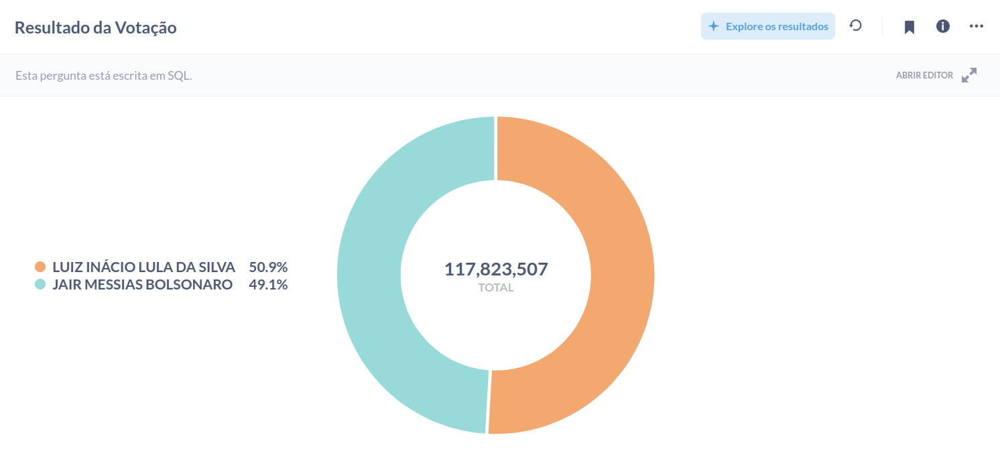
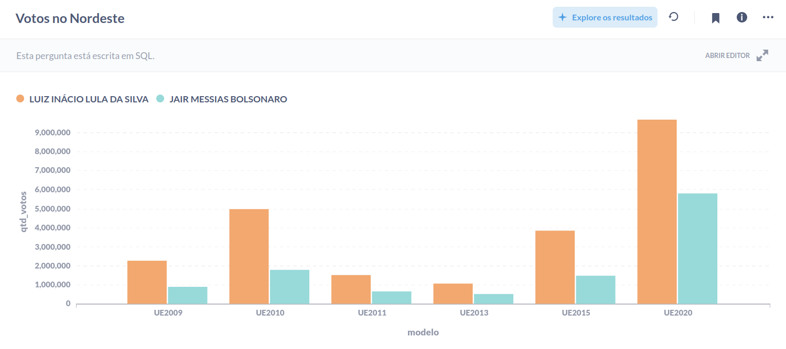
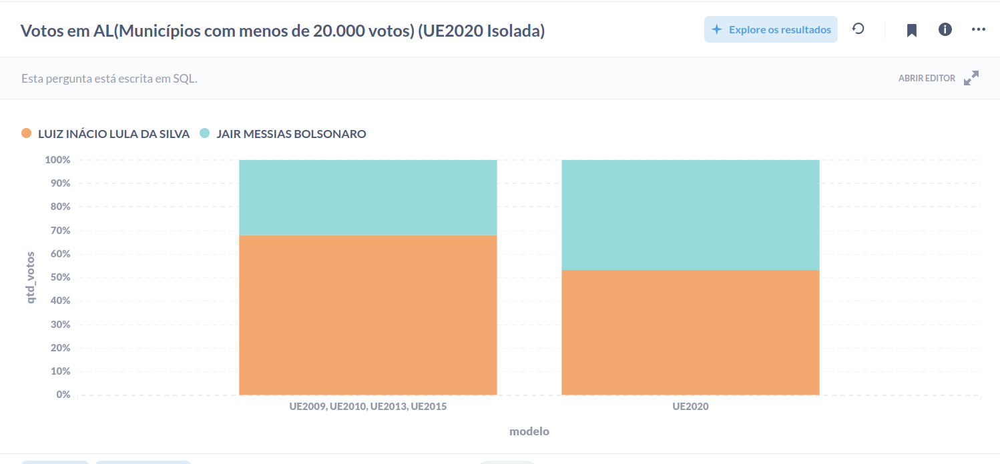

# Eleições do Brasil 2022

Olá Brasileiros! Possuímos um sistema eleitoral eletrônico implantando através da urnas eletrônicas. Nos últimos tempos muitas dúvidas surgiram referente à integridade destas urnas/máquinas. A eleição presidencial de 2022 foi sem dúvida uma das eleições mais acirradas já vistas. Por conta disso, qualquer "anomalia" presente nas máquinas pode decidir o resultado das eleições.

Este projeto visa trazer as ferramentas e os dados necessários para a análise da eleição presidencial de 2022. Após a configuração do projeto, você terá todos os dados de votação e urna compilado. Com a ajuda do [Metabase BI](https://www.metabase.com/) você conseguirá se utilizar das pesquisas já criadas como também criar as suas próprias pesquisas.

## Como executar o projeto
### Opção 1(Utiliza dados já compilados):
**Requisitos:**
- docker
- docker-compose

Para prosseguir, faça o download das bases de dados [aqui](https://drive.google.com/file/d/1AqipLzK26KJoIxGrqtUTwFhtZJrdlLx-/view?usp=sharing). Após isso, descompacte o arquivo .zip para continuar com o processo. 

1 - Execute o docker-compose para iniciar os serviços:
```
docker-compose -f compose/docker-compose-full.yml up &
```

2 - Execute o comando para criar o banco de dados de votação:

*Obs: Troque `{CONTAINER-ID}` pelo ID do container do postgresql. É possível pegar este ID através do comando `docker ps  | grep 'postgres:latest' | awk '{print $1}'`: 
```
docker exec -t {CONTAINER-ID} psql -U brasil postgres -c "CREATE DATABASE eleicoes_brasil_2022;"
```

3 - Execute o comando para restaurar o banco de dados de votos:

*Obs: Troque `caminho/para/eleicoes_brasil_2022_dump_2022-11-11_21_39_36.sql` pelo caminho do arquivo e troque `{CONTAINER-ID}` pelo id do container do postgresql. É possível pegar este ID através do comando `docker ps  | grep 'postgres:latest' | awk '{print $1}'`:
```
cat caminho/para/eleicoes_brasil_2022_dump_2022-11-11_21_39_36.sql | docker exec -i {CONTAINER-ID} psql -U brasil -d eleicoes_brasil_2022
```

Os próximos comandos serão para a restauração do banco do Metabase BI. Caso for utilizar outra ferramenta de BI, este processo pode ser pulado. Caso esteja com dúvida, continue com os próximos passos.

5 - Execute o comand para para o serviço do Metabase BI:

*Obs: Troque `{CONTAINER-ID}` pelo ID do container do metabase. É possível pegar este ID através do comando `docker ps  | grep 'metabase/metabase' | awk '{print $1}'`:
```
docker stop {CONTAINER-ID}
```

6 - Execute o comando para criar o banco de dados do Metabase BI:

*Obs: Troque `{CONTAINER-ID}` pelo ID do container do metabase. É possível pegar este ID através do comando `docker ps  | grep 'metabase/metabase' | awk '{print $1}'`:
```
docker exec -t {CONTAINER-ID} psql -U brasil postgres -c "CREATE DATABASE metabase;"
```

7 - Execute o comando para restaurar o banco de dados do Metabase BI:

*Obs: Troque `caminho/para/metabase_dump_2022-11-11_21_40_50.sql` pelo caminho do arquivo e troque `{CONTAINER-ID}` pelo ID do container do metabase. É possível pegar este ID através do comando `docker ps  | grep 'metabase/metabase' | awk '{print $1}'`:
```
cat metabase_dump_2022-11-11_21_40_50.sql | docker exec -i {CONTAINER-ID} psql -U brasil -d metabase
```

8 - Execute o comando para iniciar o serviço do Metabase API:

*Obs: Troque `{CONTAINER-ID}` pelo ID do container do metabase. É possível pegar este ID através do comando `docker ps  | grep 'metabase/metabase' | awk '{print $1}'`:
```
docker start {CONTAINER-ID}
```

Se todos os processos acima foram executados com sucesso, então você terá em sua máquina todos os dados de votos presidencias 2022 compilados no banco de dados.

***
### Opção 2(Compila os dados do zero):
**Requisitos:**
- python 3.8.+
- docker
- docker-compose

1 - Instale os requisitos do projeto:
```
pip install -r requirements.txt
```

2 - Execute o comando o comando a seguir para baixar os arquivos do TSE:

*Obs: Todos os arquivos somados contabilizam 87,1 GiB. Portanto, o tempo deste processo dependerá muito dos servidores do TSE e sua banda de rede(Pode demorar bastante mermão):
```
python brazil.py download-files --turn=2
```

3 - Execute o docker-compose para iniciar os serviços:
```
docker-compose -f compose/docker-compose-full.yml up &
```

4 - Execute o comando para processar todos os arquivos baixados do TSE e compilar os resultados no banco de dados:

*Obs: Este processo pode levar um tempo. Média de 1hr e 40m porém pode variar bastante de máquina para máquina:
```
python brazil.py process-files
```

Se todos os processos acima foram executados com sucesso, então você terá em sua máquina todos os dados de votos presidencias 2022 compilados no banco de dados.
****

## Acessando o Metabase BI

O Metabase BI estará disponível em [http://localhost:3001](http://localhost:3001). Após acessar o endereço você será direcionado para a tela de login. Basta inserir as seguintes credenciais:

E-mail: `brasil@fakedomain.com`  
Senha: `brasil2022`

#### Alguns dos relatórios diponíveis:






